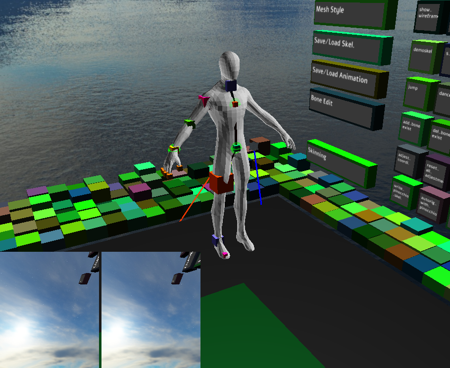
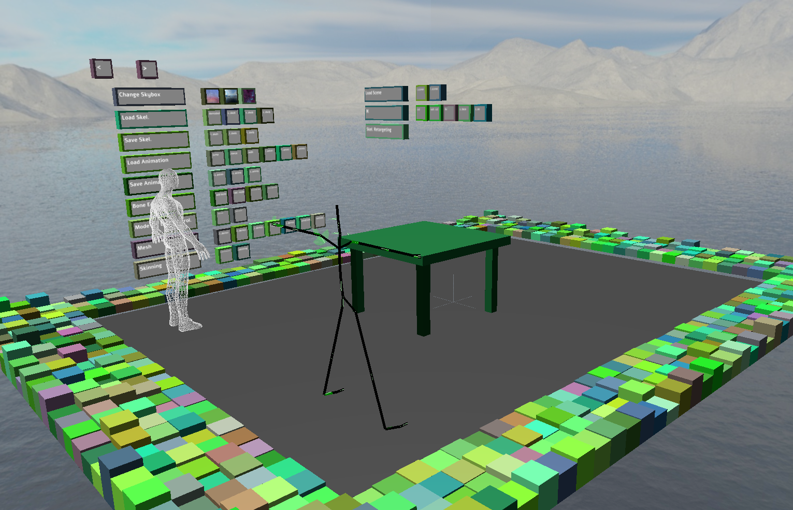
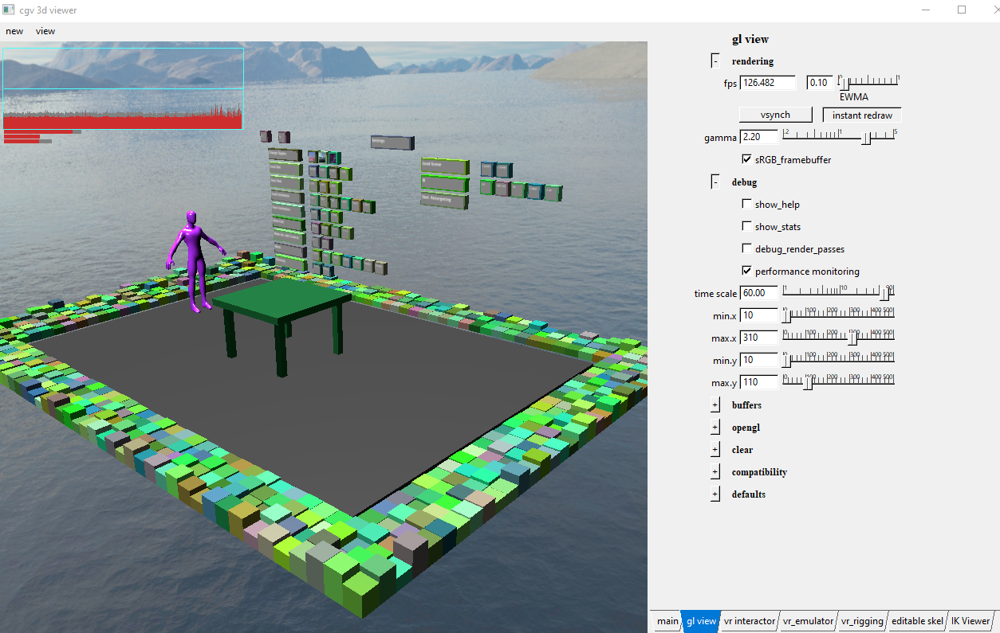
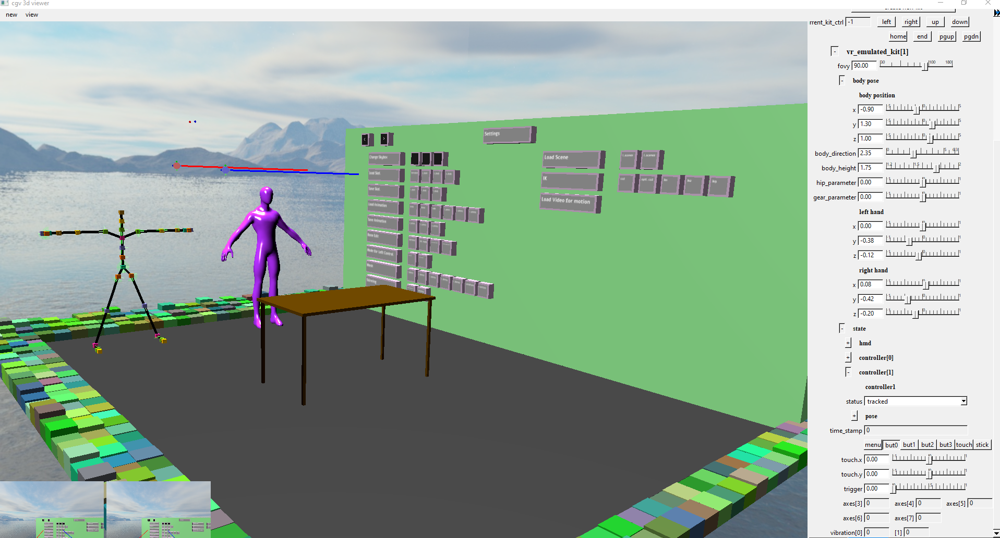
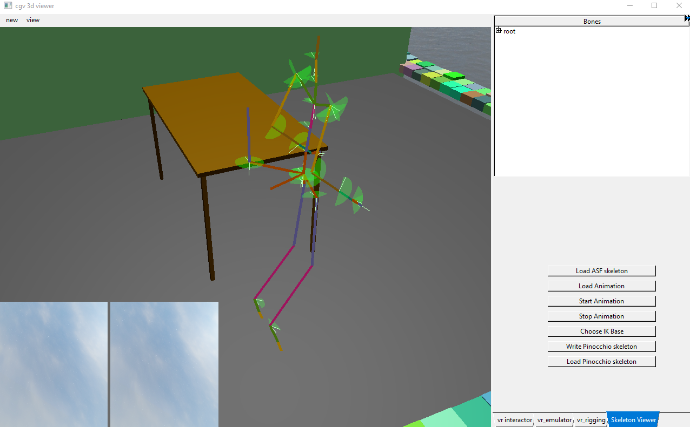
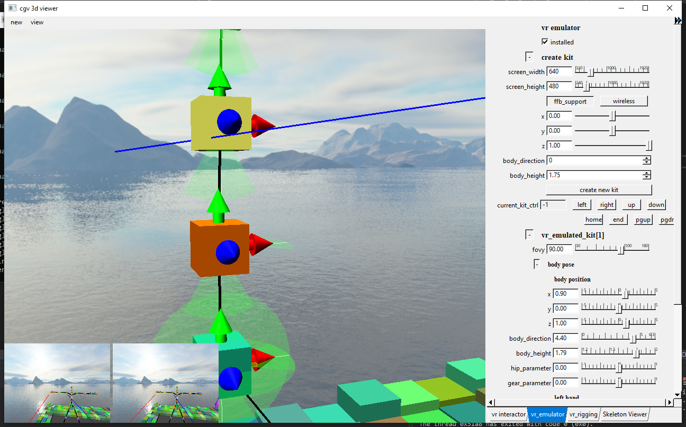
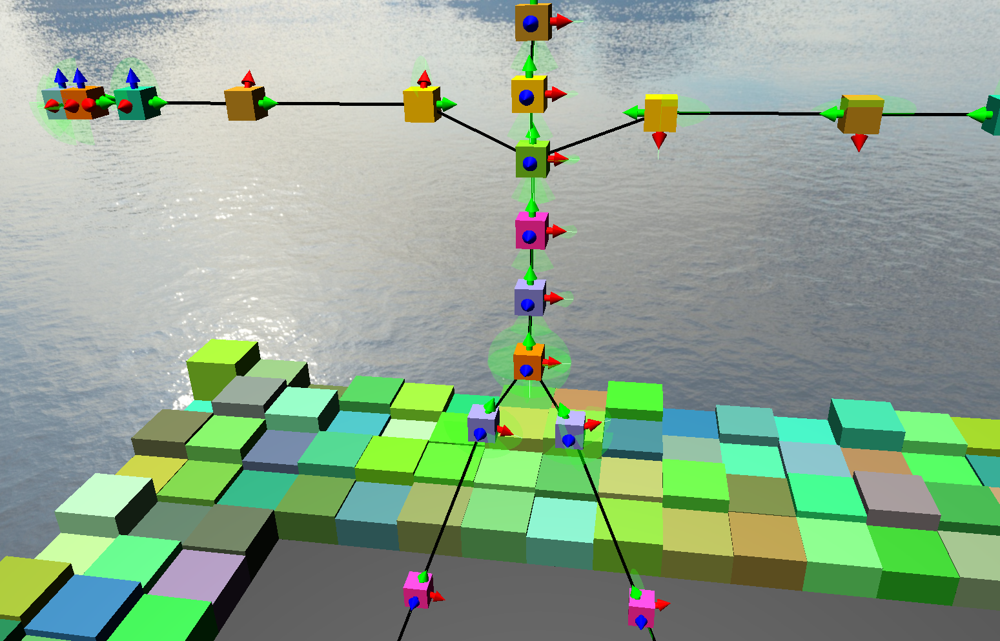
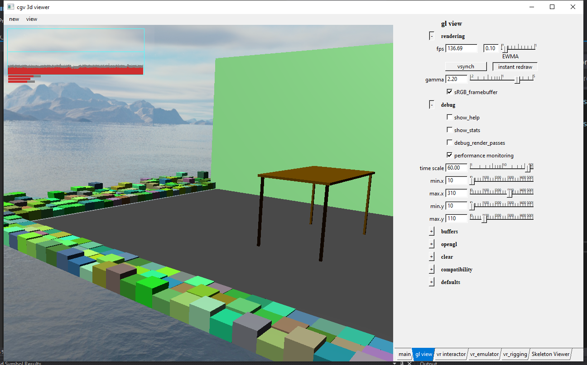
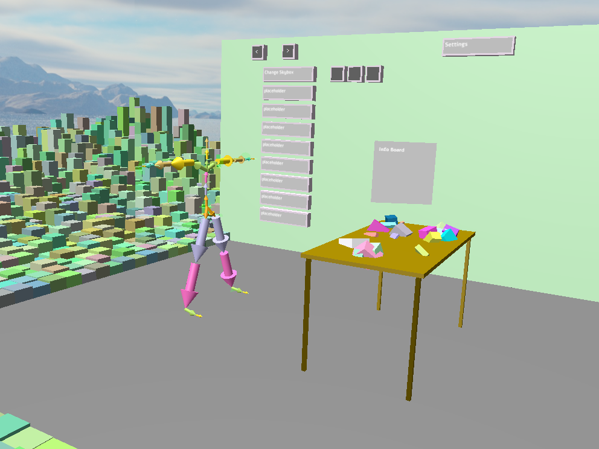

    try the executable: 
        One can run the program by simply clicking on the batch file called "run_exec.bat" 
            in the following folder: "exec\exec_vr_rigging".
        (Make sure that a visual studio is installed on your computer, 
            as some dynamic link libraries are required. This may be fixed later.) 
    build instructions: 
        Setup the resource directory by clicking on the batch file: 
            "define_resource_dir.bat" in the proj folder. 
        Generate makefiles with the help of the vr_rigging.pj (also in the proj folder) 
            as normal. (currently in the master branch of the cgv framework)
        Compile it.
        (Note that the code depends on an other project "proj_pinocchio", don't separate them)
    technique stack:
        basic user interface in VR
        create and manipulate bones of a rigging skeleton
        support CMU Graphics Lab Motion Capture Database
        skinning with created skeleton
        inverse kinematics
        numerical optimization of dofs for adjest the pinoccio skeleton 
        instanced rendering
        rotation with quaternion
        heat diffusion
        humanoid character animation
    done:
        read the code related to cgv vr proj. 
        Pinocchio was modified to be more flexible. (command line) may be merged into the project. 
        skybox in VR.
        a simple "boxgui" in VR.
            texturing the boxes 
                pin quads on to the boxes 
            make the background cubemap adjestable via boxes 
        summary and merge the rigging project in cg2.
        a simple fast navigation through scene implemented.
        draw an arrow in VR possible, will be used to draw skeleton
        code review and rewrite part of it
        scaling while reading skeleton files
        render the skeleton properly
        render the mesh properly 
        make it transparent/ or use wireframe mode 
        slight performance improvement
        frame rate problem fixed
        load animation correctly
        draw local frame correctly, which will be modified when creating new bone 
        boxes are used to represent joints 
        compute intersected joint box correctly
        create and manipulate bones, may use sphere to represent joints - use boxes
            we should support modify from a given skeleton, not only create them from scratch
            add/del. bone
            we also have to adjest local frame, and limitations 
            by adding, we should select the parent of the bone and highlight it 
        write skeleton data to a file: Skinning of a mesh with the created skeleton, draw skeleton in vr and write it to
            a file(may have to take special care when combining skeleton)
        fix the problem with bone posi. modification 
        boxgui for loading/ animating... make sure all operations can be done in vr 
        40% adjest the position of the created bone, del. a bone 
            ref. greb operations
            adjest cube size at diff. posi. 
        problem with ik when selecting target point in vr  
            fixed: we should call calculate_kinematic_chain() first to construct kinematic chain, then, setup target points 
        better gui and multiple skeleton support 
        gen. more cubemap with https://jaxry.github.io/panorama-to-cubemap/ as skybox
        Recording, saving and loading of animations created by the users movement
        include mesh and with skeleton attached
        load attachment and anim. 
        problem when saving animation: saving call takes too much time, should finish in 1/120 s
            when we want to record in 120hz
                -> frame loss problem fixed, we can only record with about 60hz
        motion capturing with IK(not accurate)
            record and load button 
            gui interface left
        a screencapture button 
        multiple views, like a mirror image
            apply_dof()
        merge ponoccio
        make the size of the box or sphere adjestable, 
            for a better locating of the joints 
            https://github.com/yzyTUD/pub_repo/blob/master/docs/out_20200728-190621.flv.mp4
        build skeleton from user input 
        * gen. skeleton from user input: one for pinocchio and an other for re-edit
        bind func. to gui button, gen. some demos 
        skeleton gen. can be saved 
        performance improvement
        hide mesh 
        adjest mesh type: wireframe, transparent....
        load diff. mesh: trans and rotation adjestment and scale:
            height adjestment with help of headset position + make use of user information!
        adjest root bone size -ok
        adjest rotation and translation for a given mesh 
            use the stick on left hand
            ok
        * mirror effect IK: animation with IK ccd 
            touch to start/stop ccd
            ok 
        * bind functionalities to gui button
            up to 3 tmp. skeleton to choose and record
            ok  
        info board 
        reset function 
            del jointlists 
        * multiple objects ik(two hands)
            video: https://github.com/yzyTUD/pub_repo/blob/master/docs/both_hands_anim.mp4
        later-skeleton edit functions
            del cooresp. line
        operation documentation  
    tobetested:
        multiple views, imitating skeletons 
    todo:  
        * improve IK
            modify the calculate_matrix function
        report
        code style improvement  
        (additional)adjest dofs in vr (details designed in private repository)
        (additional)fix the dof adjestment in course cg2, implement a numerical optimization process
        (additional)rig half of a mesh and auto-complete 
            add a button: skel_auto_complete 
        (additional)cut out part of the mesh with right hand controller 
        (additional)fix the problem in mesh loading 
        (additional)vis bone weights for each components (vertices)
        (additional)enable texturing for the mesh loader
        (additional)a better mesh loader, which is too simple now, 
            ref. the one from the prof.
    change log: 	
        07/05/2020	
        12/05/2020
        13/05/2020
        14/05/2020
        16/05/2020
        17/05/2020
        18/05/2020
        19/05/2020
        20/05/2020
        21/05/2020
        22/05/2020
        21/07/2020
        27/07/2020
        28/07/2020
        29/07/2020
        30/07/2020
        31/07/2020
        01/08/2020
        11/08/2020
        12/08/2020
        13/08/2020
        14/08/2020
    current sreenshots:

